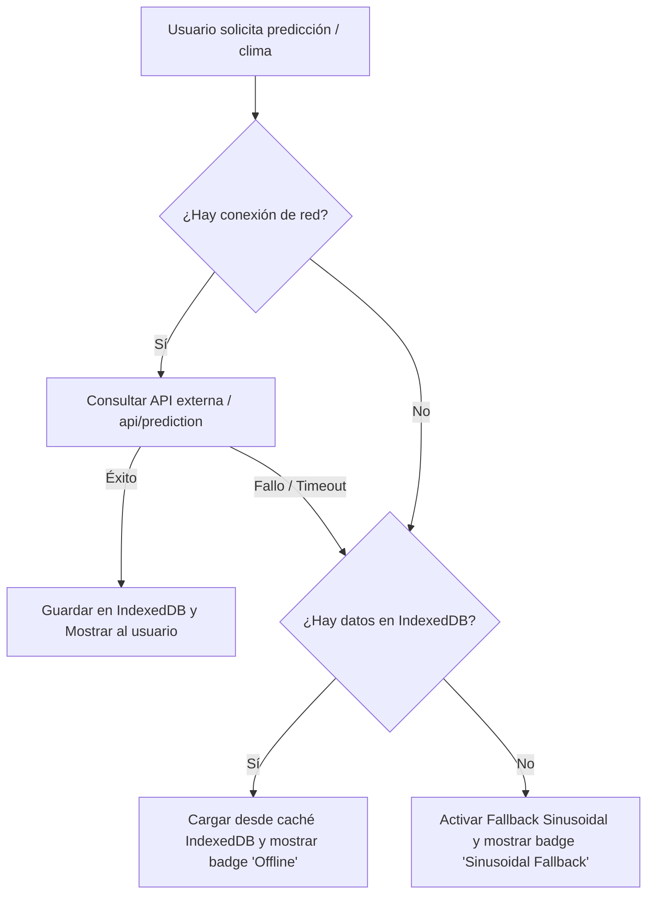

# Estrategia de Resiliencia y Fallback Offline

Este documento describe la arquitectura y los flujos diseñados en **Deteclima** para garantizar el funcionamiento ininterrumpido de la aplicación frente a fallos de conectividad o indisponibilidad de microservicios externos.

---

## 1. Arquitectura de Resiliencia

El sistema de resiliencia de Deteclima opera en múltiples capas (cliente y servidor) para proporcionar una experiencia de usuario fluida e informativa incluso sin conexión a Internet.

---

## 2. Estrategia de Caché Local con IndexedDB

Utilizamos una base de datos local **IndexedDB** (`deteclima-offline`) mediante la biblioteca ligera `idb` para persistir los siguientes almacenes de datos:

| Almacén (Store) | Clave Primaria (Key) | Datos Almacenados | Propósito |
| :--- | :--- | :--- | :--- |
| `weather-cache` | `lat,lon` | Datos climáticos actuales, timestamp | Consulta offline del clima actual |
| `predictions-cache` | `lat,lon` | Predicciones de 24 horas, timestamp | Consulta offline de predicciones de temperatura |
| `chat-history` | `sessionId` | Historial de mensajes con la IA, timestamp | Continuar conversaciones sin conexión |
| `user-preferences` | `key` | Configuración del usuario | Guardar preferencias (ej. unidades, tema) |
| `offline-queue` | Autoincremental | Cola de peticiones pendientes | Reintentar acciones pendientes al recuperar conexión |

---

## 3. Fallback Sinusoidal (Client-Side)

Cuando el usuario está completamente sin conexión (o el servidor API no responde) y **no existen datos previos cacheados** en IndexedDB para la ubicación solicitada, se activa el **Fallback Sinusoidal**.

Este fallback genera una proyección diaria realista de 24 horas basada en el patrón térmico natural de la zona:
- **Modelo Matemático**:
  $$\text{Temperatura}(t) = 12 + 8 \cdot \sin\left(\frac{(t - 8) \cdot \pi}{12}\right) + \text{ruido\_aleatorio}$$
- **Características**:
  - La temperatura alcanza su mínimo a las 8:00 AM y su máximo por la tarde.
  - Se añade un factor de ruido aleatorio real de $\pm 1^\circ\text{C}$ para evitar curvas artificialmente perfectas.
  - La confianza de predicción se establece en un rango dinámico del $85\%$ al $95\%$.
  - Se etiqueta la predicción con el número de versión `1.0.0-sinusoidal-fallback` para que la UI visualice de forma transparente que se trata de una simulación matemática.

---

## 4. Control de Tiempos de Espera (Timeouts) y Rate Limits

Para evitar llamadas que se queden en estado suspendido de forma indefinida en redes inestables, el cliente HTTP de la capa de infraestructura implementa:

1. **AbortController**:
   - Todas las llamadas fetch a la API de Open-Meteo y al microservicio de Machine Learning tienen un timeout estricto de **10 segundos**.
   - Si la llamada excede este periodo, el request es abortado y se propaga un error descriptivo: `"Open-Meteo API request timed out after 10 seconds"`, disparando el flujo de fallback correspondiente.

2. **Manejo de Límite de Peticiones (Rate Limit 429)**:
   - Se interceptan de forma explícita las respuestas HTTP `429 Too Many Requests`.
   - Lanza una excepción controlada: `"Open-Meteo API rate limit exceeded. Please try again later."` para evitar reintentos continuos que saturen la IP del cliente y notificar adecuadamente al usuario.
