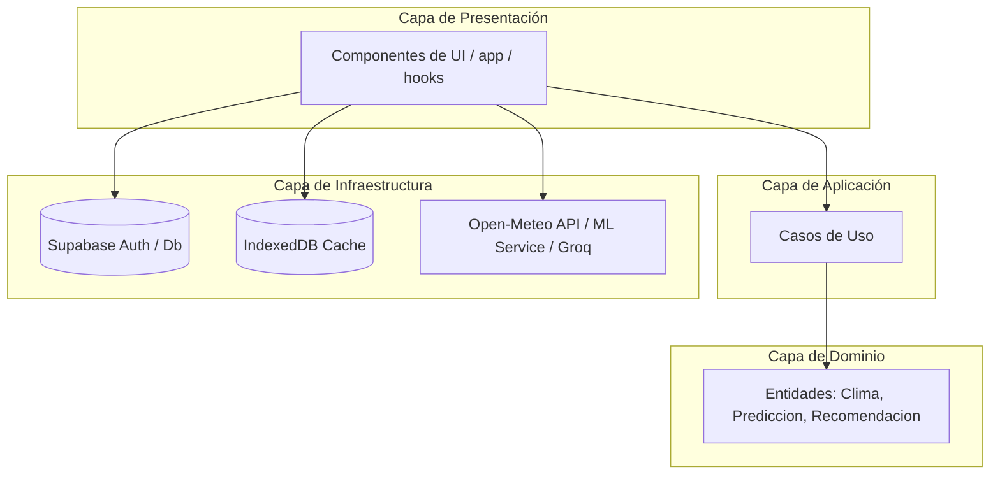

# Diseño de Arquitectura y Especificaciones: Módulo Multi-Pantalla

Este documento describe la arquitectura, el contexto general, los requerimientos y el plan de implementación detallado para migrar la interfaz de **Deteclima** desde una estructura de pantalla única (monolítica) a una plataforma multi-pantalla moderna y escalable.

---

## 1. Contexto General del Proyecto

**Deteclima** es una plataforma educativa de monitoreo climático desarrollada para el **Colegio San Vicente de Paúl en Jauja, Perú**. Su objetivo principal es ayudar a estudiantes y profesores a monitorear, comprender y predecir eventos climáticos extremos como heladas y friajes que afectan la región altoandina.

### Objetivos Iniciales
- **Visualización Climática**: Proveer un mapa interactivo para seleccionar coordenadas y visualizar datos meteorológicos en tiempo real.
- **Predicción Inteligente**: Consumir un modelo predictivo basado en Machine Learning (RandomForest) para alertar sobre bajas de temperatura en las próximas 24 horas.
- **Asistencia con IA**: Ofrecer un asistente conversacional basado en un LLM (Llama 3.3 vía Groq API) para responder consultas climáticas de alumnos y docentes usando el contexto meteorológico local.
- **Resiliencia y Tolerancia a Fallos**: Funcionar en modo sin conexión (offline) en áreas con conectividad inestable mediante caché local en IndexedDB y generación de datos climáticos simulados mediante un modelo sinusoidal de fallback.

### Arquitectura de Software
El proyecto sigue los principios de la **Arquitectura Hexagonal (Clean Architecture / Ports & Adapters)** para desacoplar el dominio de negocio de los detalles de infraestructura.

---

## 2. Requerimientos del Módulo Multi-Pantalla

El objetivo de este módulo es segmentar los widgets del panel único en páginas independientes estructuradas por roles y protegidas por autenticación.

### 2.1 Flujo de Usuario y Rutas (Basado en Roles)

| Ruta | Descripción / Funcionalidad | Nivel de Acceso | Comportamiento sin Sesión |
| :--- | :--- | :--- | :--- |
| `/` | **Mapa e Información de Clima Actual**: Vista del mapa interactivo, tarjetas climáticas y exportación de reportes en formato CSV. | **Público** (Cualquier usuario) | Permite navegación libre. |
| `/chat` | **Asistente Conversacional IA**: Panel dedicado a interactuar con el LLM Llama 3.3. | **Privado** (Docentes y Alumnos) | Redirección automática a `/auth?redirect=/chat`. |
| `/prediction` | **Predicciones y Análisis de ML**: Gráficos y proyecciones de RandomForest para las siguientes 24 horas. | **Privado** (Docentes y Alumnos) | Redirección automática a `/auth?redirect=/prediction`. |
| `/auth` | **Página de Login y Registro**: Interfaz dedicada para ingresar al sistema mediante Supabase Auth. | **Público** | Redirige de vuelta a la página original tras loguearse. |

### 2.2 Layout de Navegación: Sidebar Lateral
Se implementará una barra lateral izquierda de navegación (Sidebar) que permanezca constante a través de las páginas (definido en `layout.tsx`).

#### Características de la interfaz:
- **Diseño Responsivo**: Sidebar flotante/fijo en pantallas medianas y grandes, colapsable con un botón de menú tipo "hamburguesa" en dispositivos móviles.
- **Estética Premium**: Efectos de desenfoque de fondo (`backdrop-blur`), bordes brillantes sutiles, transiciones suaves de hover y colores que respetan la paleta existente (azul oscuro `#0a0f1e` con acentos celestes `#38bdf8`).
- **Estado de Autenticación Integrado**: El Sidebar mostrará el estado de la sesión y el perfil del usuario (con opción de cerrar sesión directa) en la parte inferior.

### 2.3 Gestión de Estado de Ubicación Híbrido (Query Params + Fallback Cache)
Para facilitar el trabajo en el aula, las coordenadas seleccionadas en el mapa se propagarán y sincronizarán entre pantallas a través de parámetros URL (`?lat=...&lon=...`).

#### Prioridad de Lectura de Coordenadas:
1. **Paso 1: Query Params**: Si los parámetros `lat` y `lon` existen en la URL actual, se usan esos valores directamente.
2. **Paso 2: LocalStorage / Cache**: Si la URL no contiene coordenadas, se leen los últimos datos guardados en la sesión local (`localStorage.getItem('deteclima_last_coords')`).
3. **Paso 3: Coordenadas por Defecto**: Si no hay datos previos, se usan las coordenadas por defecto de Jauja (`lat: -11.775`, `lon: -75.497`).

---

## 3. Plan de Implementación

### Fase 1: Creación de Componentes Comunes y Layout

#### 1. Crear el Componente `Sidebar`
- Ubicación: `src/presentation/components/Sidebar.tsx`
- Implementará enlaces de Next.js (`next/link`) hacia `/`, `/chat` y `/prediction`.
- Mantendrá y propagará los parámetros `lat` y `lon` actuales al navegar entre rutas.
- Renderizará el estado del perfil de usuario (`useAuth`) y un botón para cerrar sesión.

#### 2. Actualizar el Layout Principal (`src/app/layout.tsx`)
- Integrar el componente `Sidebar` dentro del layout.
- Adaptar la rejilla principal para soportar un diseño de dos columnas:
  - Sidebar lateral (fijo en desktop, hamburguesa en mobile).
  - Contenedor principal de contenido con `flex-1 overflow-y-auto`.

### Fase 2: Creación de la Ruta `/auth`

#### 1. Implementar la Página `/auth/page.tsx`
- Desarrollar la UI dedicada a la autenticación de usuarios.
- Reutilizar la lógica y estilos de `AuthWidget.tsx` para permitir Login y Registro de forma limpia.
- Leer el parámetro de redirección (ej: `?redirect=/chat`) para devolver al usuario tras completar el ingreso.

### Fase 3: Rutas de Negocio Específicas

#### 1. Ruta del Mapa e Inicio (`src/app/page.tsx`)
- Refactorizar `src/app/page.tsx` para quitar los widgets de Chat y ML de la parte inferior.
- Mantener únicamente el mapa, el visualizador de clima actual y el botón de exportación CSV.
- Al seleccionar una nueva ubicación en el mapa, actualizar la URL actual mediante `router.push('/?lat=...&lon=...')` sin refrescar toda la página.

#### 2. Ruta de Asistente IA (`src/app/chat/page.tsx`)
- Crear la página `/chat/page.tsx`.
- Usar un wrapper de protección (`SessionGuard`) que lea el estado `loading` y `user` de `useAuth`.
- Si el usuario no está autenticado y la carga de sesión ha finalizado, redirigir a `/auth?redirect=/chat`.
- Cargar los datos climáticos actuales usando la ubicación de los query params (con fallback) para inyectar la información meteorológica en el contexto del chat.
- Renderizar a pantalla completa el componente `ChatWidget`.

#### 3. Ruta de Predicción ML (`src/app/prediction/page.tsx`)
- Crear la página `/prediction/page.tsx`.
- Proteger la ruta de igual forma con `SessionGuard`.
- Leer las coordenadas de la URL y cargarlas en el componente `PredictionWidget`.
- Habilitar las alertas regionales si ocurren heladas o friajes.

---

## 4. Matriz de Control de Calidad y Criterios de Aceptación

1. **Prueba de Redirección**: Intentar acceder a `/chat` sin haber iniciado sesión debe llevar inmediatamente a `/auth?redirect=/chat`. Al loguearse con éxito, el usuario debe volver a `/chat`.
2. **Prueba de Enlace Compartible**: Copiar un enlace de predicción con coordenadas específicas (ej: `/prediction?lat=-12.046&lon=-77.042`) y pegarlo en una pestaña de incógnito. Al loguearse, debe mostrar las predicciones de Lima, no de Jauja por defecto.
3. **Prueba de Resiliencia / Offline**: Apagar la conexión a Internet en la consola de desarrollador de Chrome/Edge:
   - Los datos cacheados en IndexedDB deben cargarse adecuadamente en todas las páginas.
   - El Sidebar debe seguir funcionando fluidamente usando enlaces internos del Router.
4. **Diseño Responsivo**: Comprobar el Sidebar en resoluciones de celular (375px) y pantallas ultra-anchas.
